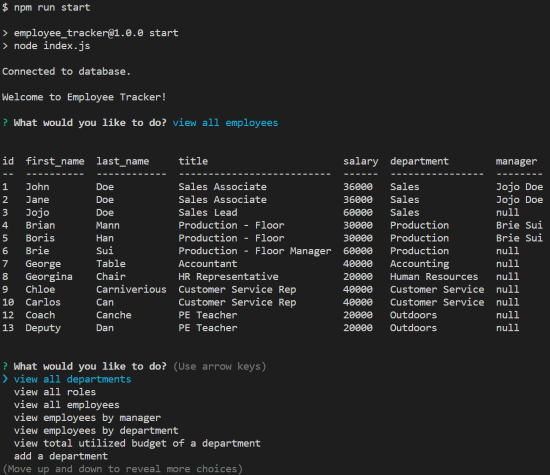

# employee_db_cms

## Description
employee_db_cms is a content management system that provides simplified options to view, create, update, delete,and interact with your own employee database via the terminal.

## Table of Contents 

- [Installation](#installation)
- [Usage](#usage)
- [License](#license)

## Installation

employee_db_cms does not require installation. 

employee_db_cms is dependant on MySQL being present in the users computer. Click [here](https://www.mysql.com/downloads/) to downnload MySQL.

## Usage

Upon cloning the repo, the user will need to input their own MySQL login information to create their database.

The current menu allows the user to 
- View all departments.
- View all roles.
- View all employees.
- Add a departments.
- Add a role.
- Add an Employee.
- Update an Employee's role.
- Update employee managers.
- View employees by manager.
- View employees by department.
- Delete departments, roles, and employees.
- View the total utilized budget of a department.

https://drive.google.com/file/d/18zzU397rDHPwQ1yb3TzOdt0M9ndUcAeG/view

## License

MIT License

Copyright (c) [2022] [employee_db_cms]

Permission is hereby granted, free of charge, to any person obtaining a copy
of this software and associated documentation files (the "Software"), to deal
in the Software without restriction, including without limitation the rights
to use, copy, modify, merge, publish, distribute, sublicense, and/or sell
copies of the Software, and to permit persons to whom the Software is
furnished to do so, subject to the following conditions:

The above copyright notice and this permission notice shall be included in all
copies or substantial portions of the Software.

THE SOFTWARE IS PROVIDED "AS IS", WITHOUT WARRANTY OF ANY KIND, EXPRESS OR
IMPLIED, INCLUDING BUT NOT LIMITED TO THE WARRANTIES OF MERCHANTABILITY,
FITNESS FOR A PARTICULAR PURPOSE AND NONINFRINGEMENT. IN NO EVENT SHALL THE
AUTHORS OR COPYRIGHT HOLDERS BE LIABLE FOR ANY CLAIM, DAMAGES OR OTHER
LIABILITY, WHETHER IN AN ACTION OF CONTRACT, TORT OR OTHERWISE, ARISING FROM,
OUT OF OR IN CONNECTION WITH THE SOFTWARE OR THE USE OR OTHER DEALINGS IN THE
SOFTWARE.

